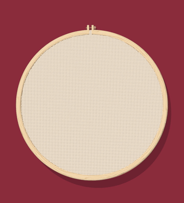

# Floss & Hoop

Turn a logo or drawing into a custom cross-stitch pattern. Preview it stitched in a wooden hoop you can turn over in 3D, then print the chart and floss list and stitch it yourself.

I built this for my wife's candy cart business, Haus Candy Co. It's free, and it runs entirely on your own computer: no account, no uploads, and no server.



**See the results first:** the [examples](examples/README.md) folder has a rendered still, a printable stitch chart, and a floss list for five Haus Candy Co. logos.

## The easy way: hand it to your AI coding agent

If you use Claude Code, Codex, or another coding agent that can run commands on your computer, paste this:

> Clone https://github.com/adam-orsin/floss-and-hoop and follow its AGENTS.md. Here's my image: [attach it or give the file path]. Pick a stitch count where the detail holds up, and tell me if anything gets lost. Render the stills, videos, and printable stitch chart with the DMC floss list, then open the 3D viewer so I can turn it around. Keep everything on my computer.

The agent installs what's needed, makes your pattern, and tells you what to buy.

**Keep the examples for your first run.** Your agent does better when it can look at finished outputs first: the stills, charts, and floss reports in [examples](examples/README.md) show it what a good result looks like. When you no longer want them, remove them with one command:

```bash
npm run clear-examples
```

That deletes the Haus Candy Co. designs and the `examples/` folder. Your own designs and renders stay.

## What you get

- **Stitch chart:** a printable counted cross-stitch pattern. Each square is one X stitch, and its symbol tells you the floss color. Find the center with the red arrows, count squares, and stitch on plain Aida fabric.
- **Floss list:** the DMC floss number for each color, how many stitches use it, and about how many skeins to buy.
- **3D hoop:** drag to turn it, click **Back** to see the back of the work, and scroll to zoom into the threads.
- **Stills and videos:** an Instagram feed post (1080 × 1350), a story (1080 × 1920), a push-in video from the full hoop to the threads, and a stitch-on video where the design is sewn row by row.
- **Detail report:** what changed to make the art stitchable, like dots that became French knots, thin lines that became backstitch, and shapes too small to keep.

## Art that works best

Bold shapes with a few flat colors stitch best: logos, icons, holiday shapes, and short words in big letters. Photos and detailed illustrations get messy, and small text turns into blobs. The report says when that happens.

## Doing it yourself

You need Node.js 20 or later. For the videos, you also need [ffmpeg](https://ffmpeg.org).

1. Install:

   ```bash
   npm install
   ```

   ```bash
   npx playwright install chromium
   ```

2. Make a pattern from your image:

   ```bash
   npm run make -- path/to/your-image.png
   ```

   The command picks a stitch count, renders everything into `exports/`, and opens the gallery and 3D viewer in your browser. For options like `--grid`, `--fabric white`, and `--colors`, see [AGENTS.md](AGENTS.md).

3. Open the editor to try the built-in Haus Candy Co. designs or your own:

   ```bash
   npm run dev
   ```

   Then open `http://127.0.0.1:5190`.

## How it's built

- **[Three.js](https://threejs.org):** draws the 3D floss, fabric, and hoop with WebGL.
- **[Vite](https://vitejs.dev):** runs the app locally and saves exports.
- **[Playwright](https://playwright.dev):** renders stills and video frames in a headless browser.
- **[ffmpeg](https://ffmpeg.org):** turns the frames into MP4 videos.
- **Plain JavaScript:** handles the pattern. It snaps colors, picks French knots and backstitch, matches DMC floss with CIEDE2000 color math, and draws the chart.

## Credits

DMC floss colors come from [makebead/craft-color-codes](https://github.com/makebead/craft-color-codes) (MIT). They're approximate, so check them against a real DMC color card before you buy. DMC is a trademark of DMC, and this project isn't affiliated with it.

## License

MIT. See [LICENSE](LICENSE).
