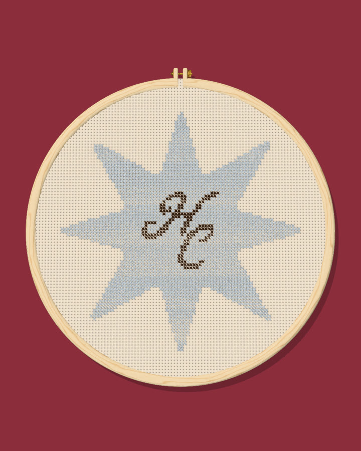
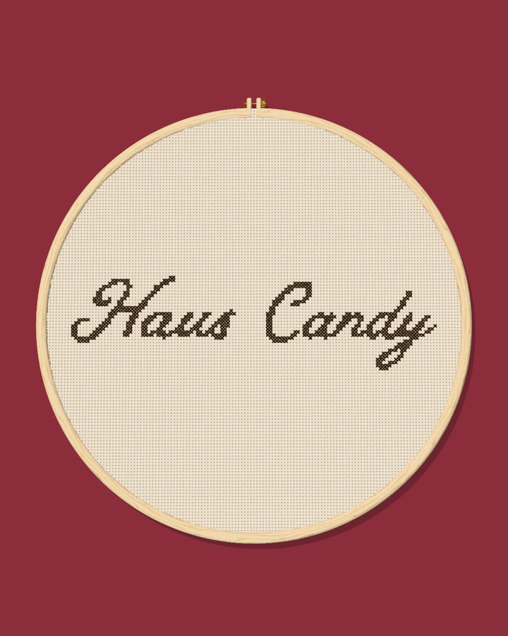
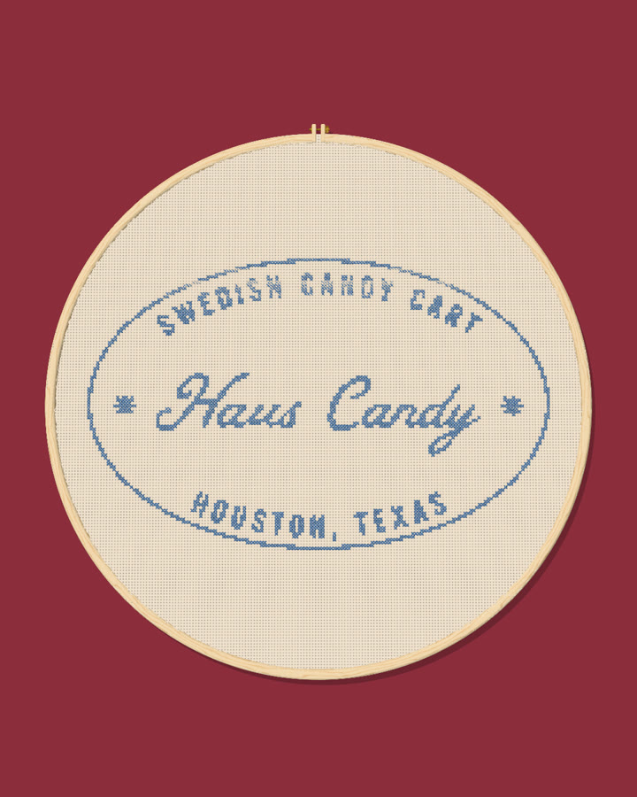

# Examples

Each design was rendered with `npm run make`. Open one for its stitch chart and floss list.

## Haus Candy Co. examples

| Design | Size | Rendered | Chart |
|---|---|---|---|
| [Monogram star](monogram-star/README.md) | 80 × 80 stitches |  | [Stitch chart](monogram-star/chart.png) |
| [Primary logo](primary-logo/README.md) | 120 × 31 stitches |  | [Stitch chart](primary-logo/chart.png) |
| [Badge](badge-cornflower/README.md) | 120 × 86 stitches |  | [Stitch chart](badge-cornflower/chart.png) |
| [Oval stamp](oval-stamp-cornflower/README.md) | 160 × 101 stitches |  | [Stitch chart](oval-stamp-cornflower/chart.png) |
| [Scalloped border](scalloped-border/README.md) | 100 × 72 stitches |  | [Stitch chart](scalloped-border/chart.png) |
