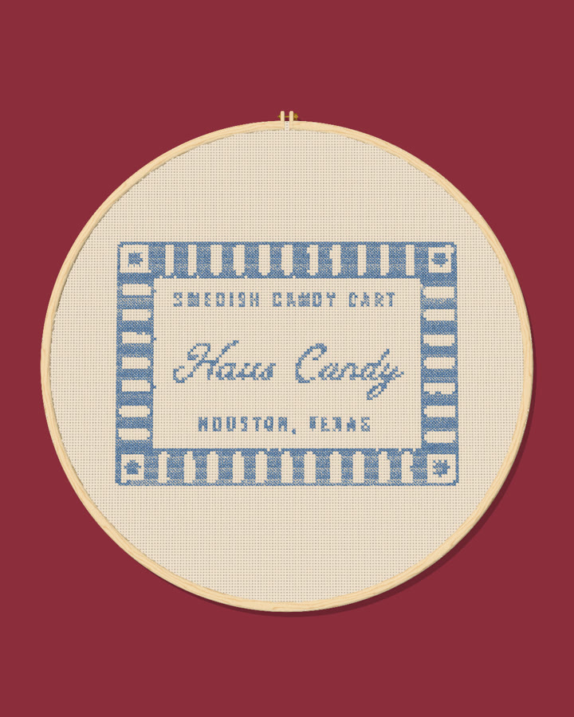

# Badge

[Stitch chart](chart.png) · [Detail check](detail-check.png)

- **Size:** 120 × 86 stitches. On 14-count Aida that's 8.6 × 6.1 in; on 18-count, 6.7 × 4.8 in.
- **Fabric:** cream Aida.
- **Shape match:** 0.82 (1.00 is a perfect match with the original art).

## Floss to buy

| Color | DMC | Name | Cross stitches | Skeins (about) |
|---|---|---|---|---|
| #648BBD | 799 | Delft Blue Medium | 3587 | 3 |

DMC matches are the closest by color math. Check them against a real DMC color card before you buy.

## What the stitching changes

- 1 small dot becomes a French knot.
- 11 thin lines become backstitch (single-thread outlines).
