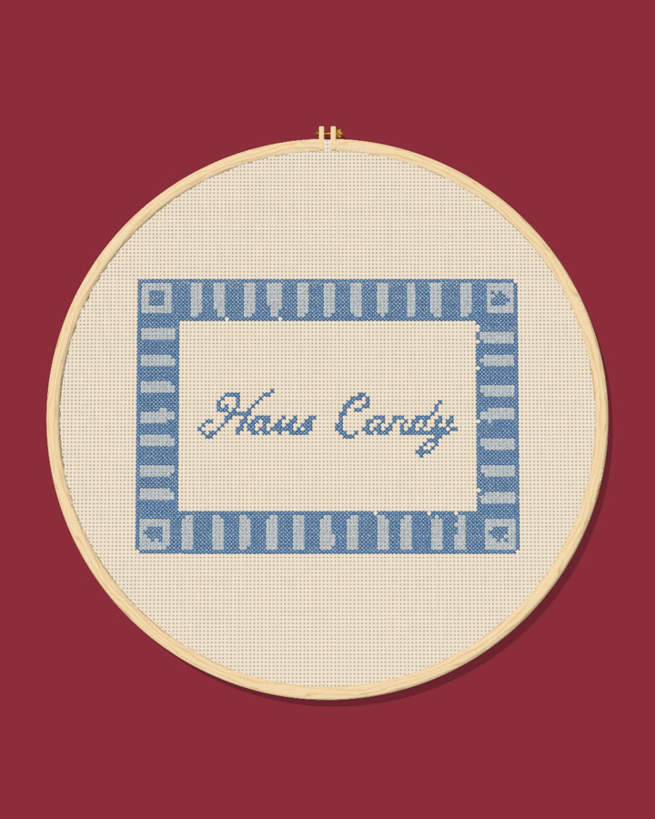

# Scalloped border

[Stitch chart](chart.png) · [Detail check](detail-check.png)

- **Size:** 100 × 72 stitches. On 14-count Aida that's 7.1 × 5.1 in; on 18-count, 5.6 × 4.0 in.
- **Fabric:** cream Aida.
- **Shape match:** 0.80 (1.00 is a perfect match with the original art).

## Floss to buy

| Color | DMC | Name | Cross stitches | Skeins (about) |
|---|---|---|---|---|
| #F8EEDF | none | Not stitched: matches the fabric | 0 | 0 |
| #648BBD | 799 | Delft Blue Medium | 2380 | 2 |
| #C6D3E1 | 3752 | Antique Blue Very Light | 1119 | 1 |

DMC matches are the closest by color math. Check them against a real DMC color card before you buy.

## What the stitching changes

- 5 thin lines become backstitch (single-thread outlines).
- 24 shapes are too small to stitch at this size. The pink areas in `detail-check.png` show where.
